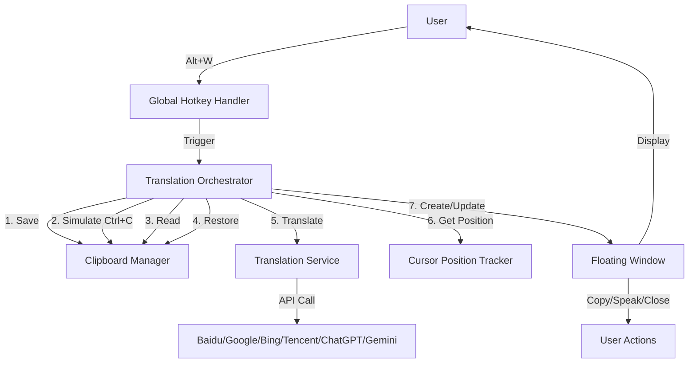
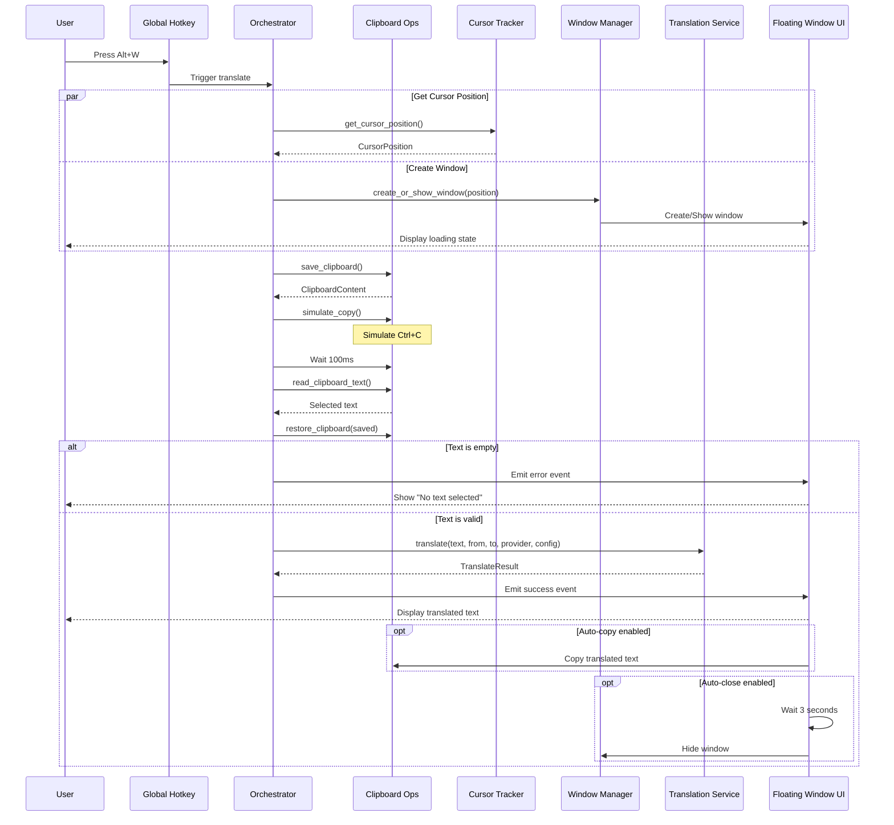

# Design Document: Word Selection Translate (划词翻译)

## Overview

The Word Selection Translate feature enables users to quickly translate selected text from any application using a global hotkey (Alt+W). The system captures the selected text via clipboard simulation, translates it using configured translation services, and displays results in a floating window positioned near the cursor.

This feature reuses the existing translation service infrastructure from QuickTranslateWindow and extends it with:

- Global hotkey registration and handling
- Clipboard save/restore mechanism
- Cursor position detection
- Frameless floating window with smart positioning
- Minimal UI optimized for quick interactions

### Key Design Principles

1. **Non-intrusive**: Minimal disruption to user workflow
2. **Performance**: Fast response times (<200ms window display, <600ms clipboard operations)
3. **Reusability**: Leverage existing translation service infrastructure
4. **Robustness**: Graceful error handling and clipboard state preservation

## Architecture

### High-Level Architecture



### Component Layers

```
┌─────────────────────────────────────────────────────┐
│              Frontend (React/TypeScript)             │
│  ┌────────────────────────────────────────────────┐ │
│  │  WordSelectionTranslateWindow Component        │ │
│  │  - Floating UI                                 │ │
│  │  - Loading states                              │ │
│  │  - Action buttons (Copy/Speak/Close)           │ │
│  └────────────────────────────────────────────────┘ │
└─────────────────────────────────────────────────────┘
                         ↕
┌─────────────────────────────────────────────────────┐
│              Backend (Rust/Tauri)                    │
│  ┌────────────────────────────────────────────────┐ │
│  │  Hotkey Registration & Event Handling          │ │
│  └────────────────────────────────────────────────┘ │
│  ┌────────────────────────────────────────────────┐ │
│  │  Clipboard Operations Module                   │ │
│  │  - Save/Restore clipboard state                │ │
│  │  - Simulate Ctrl+C                             │ │
│  │  - Read clipboard text                         │ │
│  └────────────────────────────────────────────────┘ │
│  ┌────────────────────────────────────────────────┐ │
│  │  Translation Service (Existing)                │ │
│  │  - translate::translate()                      │ │
│  │  - Multiple provider support                   │ │
│  └────────────────────────────────────────────────┘ │
│  ┌────────────────────────────────────────────────┐ │
│  │  Window Management                             │ │
│  │  - Create floating window                      │ │
│  │  - Position calculation                        │ │
│  │  - Screen boundary detection                   │ │
│  └────────────────────────────────────────────────┘ │
└─────────────────────────────────────────────────────┘
                         ↕
┌─────────────────────────────────────────────────────┐
│              System APIs                             │
│  - Global Shortcut Manager (Tauri)                  │
│  - Clipboard API (arboard crate)                    │
│  - Cursor Position API (Windows/Linux/macOS)        │
│  - Window API (Tauri)                               │
└─────────────────────────────────────────────────────┘
```

## Components and Interfaces

### 1. Hotkey Registration Module

**Location**: `src-tauri/src/main.rs`

**Responsibilities**:

- Register Alt+W global hotkey on application startup
- Handle hotkey configuration updates
- Trigger translation workflow when hotkey is pressed

**Interface**:

```rust
pub fn register_word_selection_translate_shortcut(
    app_handle: &tauri::AppHandle,
    shortcut: &str
) {
    // Register global shortcut
    // On trigger: call word_selection_translate()
}

fn word_selection_translate(app_handle: &tauri::AppHandle) {
    // Orchestrate the translation workflow
}
```

**Integration Points**:

- Called from `main()` during app initialization
- Called from `update_word_selection_translate_shortcut` command when user changes hotkey
- Triggers clipboard operations and window creation

### 2. Clipboard Operations Module

**Location**: `src-tauri/src/clipboard_operations.rs` (new file)

**Responsibilities**:

- Save current clipboard content
- Simulate Ctrl+C key press to copy selected text
- Read text from clipboard
- Restore original clipboard content
- Handle clipboard operation timeouts and errors

**Interface**:

```rust
use arboard::Clipboard;
use enigo::{Enigo, Key, KeyboardControllable};

pub struct ClipboardOperations {
    clipboard: Clipboard,
    enigo: Enigo,
}

impl ClipboardOperations {
    pub fn new() -> Result<Self, String>;

    /// Save current clipboard content
    pub fn save_clipboard(&mut self) -> Result<ClipboardContent, String>;

    /// Simulate Ctrl+C to copy selected text
    pub fn simulate_copy(&mut self) -> Result<(), String>;

    /// Read text from clipboard with timeout
    pub fn read_clipboard_text(&mut self, timeout_ms: u64) -> Result<String, String>;

    /// Restore previously saved clipboard content
    pub fn restore_clipboard(&mut self, content: ClipboardContent) -> Result<(), String>;
}

pub enum ClipboardContent {
    Text(String),
    Image(Vec<u8>),
    Empty,
}
```

**Dependencies**:

- `arboard` crate for clipboard access
- `enigo` crate for keyboard simulation
- `std::thread::sleep` for timing control

**Error Handling**:

- Timeout if clipboard read takes >500ms
- Return error if clipboard is inaccessible
- Log errors for debugging

### 3. Cursor Position Tracker

**Location**: `src-tauri/src/cursor_position.rs` (new file)

**Responsibilities**:

- Get current cursor position (x, y coordinates)
- Get screen dimensions
- Handle multi-monitor setups

**Interface**:

```rust
#[derive(Debug, Clone, Serialize, Deserialize)]
pub struct CursorPosition {
    pub x: i32,
    pub y: i32,
}

#[derive(Debug, Clone, Serialize, Deserialize)]
pub struct ScreenInfo {
    pub width: u32,
    pub height: u32,
    pub x: i32,  // For multi-monitor
    pub y: i32,
}

pub fn get_cursor_position() -> Result<CursorPosition, String>;
pub fn get_screen_info() -> Result<ScreenInfo, String>;
```

**Platform-Specific Implementation**:

- Windows: Use `GetCursorPos` from Win32 API
- Linux: Use X11 or Wayland APIs
- macOS: Use Core Graphics API

### 4. Window Management Module

**Location**: `src-tauri/src/main.rs` (extend existing window management)

**Responsibilities**:

- Create or reuse floating window
- Calculate window position near cursor
- Ensure window stays within screen boundaries
- Configure window properties (frameless, always-on-top, etc.)

**Interface**:

```rust
fn create_or_show_word_selection_window(
    app_handle: &tauri::AppHandle,
    cursor_pos: CursorPosition,
    screen_info: ScreenInfo,
) -> Result<(), String> {
    // Check if window exists
    // If exists: reposition and show
    // If not: create new window with calculated position
}

fn calculate_window_position(
    cursor_pos: CursorPosition,
    window_size: (u32, u32),
    screen_info: ScreenInfo,
) -> (i32, i32) {
    // Position window near cursor (within 50px)
    // Adjust if would go off-screen
}
```

**Window Configuration**:

```rust
tauri::WindowBuilder::new(
    app_handle,
    "word-selection-translate",
    tauri::WindowUrl::App("index.html".into()),
)
.title("Word Selection Translate")
.inner_size(400.0, 300.0)  // Compact size
.decorations(false)         // Frameless
.transparent(false)
.resizable(false)
.always_on_top(true)
.skip_taskbar(true)
.focused(true)
.visible(false)             // Initially hidden
.position(x, y)             // Calculated position
.build()
```

### 5. Translation Orchestrator

**Location**: `src-tauri/src/word_selection_translate.rs` (new file)

**Responsibilities**:

- Orchestrate the complete translation workflow
- Handle timing and sequencing of operations
- Manage error states and recovery

**Interface**:

```rust
pub async fn execute_word_selection_translate(
    app_handle: tauri::AppHandle,
    settings: WordSelectionTranslateSettings,
) -> Result<(), String> {
    // 1. Get cursor position
    // 2. Create/show window with loading state
    // 3. Save clipboard
    // 4. Simulate Ctrl+C
    // 5. Wait and read clipboard
    // 6. Restore clipboard
    // 7. Translate text
    // 8. Update window with result
}

#[derive(Debug, Clone, Serialize, Deserialize)]
pub struct WordSelectionTranslateSettings {
    pub provider: String,
    pub from_lang: String,
    pub to_lang: String,
    pub translate_config: translate::TranslateConfig,
}
```

**Workflow Sequence**:

```
1. Get cursor position (5ms)
2. Create/show window at position (50ms)
3. Display loading indicator (immediate)
4. Save clipboard (50ms)
5. Simulate Ctrl+C (100ms)
6. Wait for clipboard update (100ms)
7. Read clipboard text (50ms)
8. Restore original clipboard (50ms)
9. Validate text (10ms)
10. Call translation service (1-5s depending on provider)
11. Update window with result (50ms)

Total: ~200ms for window display, ~400ms for clipboard ops, 1-5s for translation
```

### 6. Frontend Component

**Location**: `src/tools/WordSelectionTranslateWindow.tsx` (new file)

**Responsibilities**:

- Display loading state
- Show original and translated text
- Provide action buttons (Copy, Speak, Close)
- Handle user interactions
- Listen for window events

**Component Structure**:

```typescript
interface WordSelectionTranslateWindowProps {}

interface TranslateState {
  loading: boolean;
  originalText: string;
  translatedText: string;
  fromLang: string;
  toLang: string;
  error: string | null;
}

export default function WordSelectionTranslateWindow() {
  const [state, setState] = useState<TranslateState>({
    loading: true,
    originalText: '',
    translatedText: '',
    fromLang: '',
    toLang: '',
    error: null,
  });

  // Listen for translation events from backend
  useEffect(() => {
    const unlisten = listen('word-selection-translate-result', (event) => {
      // Update state with translation result
    });
    return () => unlisten.then(fn => fn());
  }, []);

  // Handle copy action
  const handleCopy = async () => {
    await navigator.clipboard.writeText(state.translatedText);
    // Show confirmation
  };

  // Handle speak action
  const handleSpeak = () => {
    const utterance = new SpeechSynthesisUtterance(state.translatedText);
    utterance.lang = state.toLang;
    window.speechSynthesis.speak(utterance);
  };

  // Handle close action
  const handleClose = async () => {
    await appWindow.hide();
  };

  // Handle Escape key
  useEffect(() => {
    const handleKeyDown = (e: KeyboardEvent) => {
      if (e.key === 'Escape') {
        handleClose();
      }
    };
    window.addEventListener('keydown', handleKeyDown);
    return () => window.removeEventListener('keydown', handleKeyDown);
  }, []);

  return (
    <div className="floating-translate-window">
      {/* Compact UI with original text, translated text, and action buttons */}
    </div>
  );
}
```

### 7. Settings Integration

**Location**: `src/stores/settingsStore.ts` (extend existing)

**New Settings**:

```typescript
interface AppSettings {
  // ... existing settings ...

  // Word Selection Translate settings
  wordSelectionTranslateShortcut: string; // Default: 'Alt+W'
  wordSelectionTranslateProvider: string; // Default: same as translateProvider
  wordSelectionTranslateFromLang: string; // Default: 'auto'
  wordSelectionTranslateToLang: string; // Default: 'zh'
  wordSelectionTranslateAutoCopy: boolean; // Default: false
  wordSelectionTranslateAutoClose: boolean; // Default: false (close after 3s)
  wordSelectionTranslateAutoCloseDelay: number; // Default: 3000ms
}
```

**Tauri Commands**:

```rust
#[tauri::command]
fn update_word_selection_translate_shortcut(
    app_handle: tauri::AppHandle,
    shortcut: String
) {
    register_word_selection_translate_shortcut(&app_handle, &shortcut);
}
```

## Data Models

### ClipboardContent

```rust
pub enum ClipboardContent {
    Text(String),
    Image(Vec<u8>),
    Empty,
}
```

**Purpose**: Represent different types of clipboard content for save/restore operations.

### CursorPosition

```rust
#[derive(Debug, Clone, Serialize, Deserialize)]
pub struct CursorPosition {
    pub x: i32,
    pub y: i32,
}
```

**Purpose**: Store cursor coordinates for window positioning.

### ScreenInfo

```rust
#[derive(Debug, Clone, Serialize, Deserialize)]
pub struct ScreenInfo {
    pub width: u32,
    pub height: u32,
    pub x: i32,
    pub y: i32,
}
```

**Purpose**: Store screen dimensions and position for multi-monitor support.

### WordSelectionTranslateSettings

```rust
#[derive(Debug, Clone, Serialize, Deserialize)]
pub struct WordSelectionTranslateSettings {
    pub provider: String,
    pub from_lang: String,
    pub to_lang: String,
    pub auto_copy: bool,
    pub auto_close: bool,
    pub auto_close_delay: u64,
    pub translate_config: translate::TranslateConfig,
}
```

**Purpose**: Encapsulate all settings needed for word selection translation.

### TranslateEvent

```typescript
interface TranslateEvent {
  type: 'loading' | 'success' | 'error';
  originalText?: string;
  translatedText?: string;
  fromLang?: string;
  toLang?: string;
  error?: string;
}
```

**Purpose**: Event payload for communication between backend and frontend.

## Data Flow

### Complete Translation Workflow



### Window Positioning Algorithm

```
Input: cursor_pos (x, y), window_size (w, h), screen_info (sw, sh, sx, sy)

1. Calculate initial position:
   - window_x = cursor_pos.x + 20  // 20px offset from cursor
   - window_y = cursor_pos.y + 20

2. Check right boundary:
   if window_x + w > sx + sw:
       window_x = cursor_pos.x - w - 20  // Position to left of cursor

3. Check bottom boundary:
   if window_y + h > sy + sh:
       window_y = sy + sh - h - 10  // Position at bottom with 10px margin

4. Check left boundary:
   if window_x < sx:
       window_x = sx + 10  // Position at left edge with 10px margin

5. Check top boundary:
   if window_y < sy:
       window_y = sy + 10  // Position at top edge with 10px margin

Output: (window_x, window_y)
```

### Error Handling Flow

```mermaid
graph TD
    Start[Start Translation] --> CheckHotkey{Hotkey Registered?}
    CheckHotkey -->|No| ErrorHotkey[Show Hotkey Error]
    CheckHotkey -->|Yes| SaveClipboard[Save Clipboard]

    SaveClipboard --> CheckSave{Save Success?}
    CheckSave -->|No| ErrorClipboard[Show Clipboard Error]
    CheckSave -->|Yes| SimulateCopy[Simulate Ctrl+C]

    SimulateCopy --> WaitRead[Wait & Read Clipboard]
    WaitRead --> CheckRead{Read Success?}
    CheckRead -->|No| RestoreAndError[Restore Clipboard & Show Error]
    CheckRead -->|Yes| CheckEmpty{Text Empty?}

    CheckEmpty -->|Yes| RestoreAndEmpty[Restore Clipboard & Show "No Text"]
    CheckEmpty -->|No| RestoreClipboard[Restore Clipboard]

    RestoreClipboard --> CheckAPI{API Configured?}
    CheckAPI -->|No| ErrorAPI[Show API Config Error]
    CheckAPI -->|Yes| Translate[Call Translation Service]

    Translate --> CheckTranslate{Translate Success?}
    CheckTranslate -->|No| ErrorTranslate[Show Translation Error]
    CheckTranslate -->|Yes| ShowResult[Show Result]

    ErrorHotkey --> End[End]
    ErrorClipboard --> End
    RestoreAndError --> End
    RestoreAndEmpty --> End
    ErrorAPI --> End
    ErrorTranslate --> End
    ShowResult --> End
```

## Error Handling

### Error Categories

1. **Hotkey Registration Errors**
   - Conflict with system or other app shortcuts
   - Invalid hotkey format
   - **Handling**: Display error message during registration, log error

2. **Clipboard Operation Errors**
   - Clipboard inaccessible
   - Clipboard operation timeout
   - Failed to restore clipboard
   - **Handling**: Display user-friendly error, suggest manual copy-paste, log error

3. **Text Capture Errors**
   - No text selected
   - Empty or whitespace-only text
   - **Handling**: Display "No text selected" message, hide window after 2s

4. **Translation Service Errors**
   - API credentials missing or invalid
   - Network error
   - Service unavailable
   - Rate limit exceeded
   - **Handling**: Display specific error message in window, keep window open for user to read

5. **Window Management Errors**
   - Failed to create window
   - Failed to position window
   - **Handling**: Log error, fallback to center position

### Error Messages

```typescript
const ERROR_MESSAGES = {
  HOTKEY_CONFLICT: '快捷键冲突，请在设置中更改快捷键',
  CLIPBOARD_INACCESSIBLE: '无法访问剪贴板，请检查权限设置',
  CLIPBOARD_TIMEOUT: '剪贴板操作超时，请重试',
  NO_TEXT_SELECTED: '未选中任何文本',
  EMPTY_TEXT: '选中的文本为空',
  API_NOT_CONFIGURED: '请先在设置中配置翻译服务的 API 密钥',
  NETWORK_ERROR: '网络错误，请检查网络连接',
  SERVICE_UNAVAILABLE: '翻译服务暂时不可用，请稍后重试',
  RATE_LIMIT: '已达到 API 调用限制，请稍后重试',
  TRANSLATION_FAILED: '翻译失败，请重试',
};
```

### Error Recovery Strategies

1. **Clipboard State Recovery**
   - Always restore clipboard in finally block
   - Log if restore fails but don't block user

2. **Window State Recovery**
   - Reuse existing window if available
   - Reset window state on new translation request

3. **Translation Retry**
   - Don't auto-retry (user can manually retry)
   - Preserve original text for manual retry

4. **Graceful Degradation**
   - If window positioning fails, use center position
   - If auto-copy fails, provide manual copy button
   - If TTS fails, hide speak button

## Testing Strategy

### Property-Based Testing Assessment

**Property-based testing is NOT applicable for this feature** because:

1. **System Integration**: The feature heavily relies on system-level operations (clipboard access, global hotkeys, cursor tracking) that are not pure functions
2. **UI Rendering**: Floating window positioning and display are visual/layout concerns
3. **External Services**: Translation API calls are already tested in the existing translation infrastructure
4. **Side-Effect Operations**: Clipboard save/restore, keyboard simulation, and window management are inherently side-effectful

This feature falls into the categories where PBT is inappropriate:

- UI rendering and layout
- Side-effect-only operations (clipboard, keyboard simulation)
- Workflows with external dependencies (translation APIs)

### Testing Approach

The testing strategy uses **unit tests** for pure logic (window positioning algorithm, text validation), **integration tests** for system interactions (clipboard operations, window management), and **manual tests** for end-to-end validation.

### Unit Tests

**Window Positioning Algorithm** (Pure Logic):

- Test positioning near cursor (normal case)
- Test adjustment when window would go off right edge
- Test adjustment when window would go off bottom edge
- Test adjustment when window would go off left edge
- Test adjustment when window would go off top edge
- Test multi-monitor positioning
- Test with various window sizes
- Test with various screen resolutions

**Text Validation** (Pure Logic):

- Test empty string detection
- Test whitespace-only string detection
- Test text length validation (max 5000 characters)
- Test special character handling
- Test Unicode character handling

**Settings Validation** (Pure Logic):

- Test valid hotkey format detection
- Test language code validation
- Test provider name validation

**Clipboard Operations Module** (Integration Tests - moved below):

- Test save and restore with text content
- Test save and restore with image content
- Test save and restore with empty clipboard
- Test simulate_copy() execution
- Test read_clipboard_text() with timeout
- Test error handling for inaccessible clipboard

**Cursor Position Tracker** (Integration Tests - moved below):

- Test get_cursor_position() returns valid coordinates
- Test get_screen_info() returns valid dimensions
- Test multi-monitor scenarios

**Translation Orchestrator** (Integration Tests - moved below):

- Test complete workflow with valid text
- Test workflow with empty text
- Test workflow with clipboard errors
- Test workflow with translation errors
- Test timing constraints (200ms window, 600ms clipboard)

### Integration Tests

**Clipboard Operations**:

- Test save and restore with text content
- Test save and restore with image content
- Test save and restore with empty clipboard
- Test simulate_copy() execution
- Test read_clipboard_text() with timeout
- Test error handling for inaccessible clipboard
- Test clipboard state preservation across operations

**Cursor Position Tracking**:

- Test get_cursor_position() returns valid coordinates
- Test get_screen_info() returns valid dimensions
- Test multi-monitor scenarios
- Test cursor position on different screens

**Window Management**:

- Test window creation and positioning
- Test window reuse on subsequent triggers
- Test window visibility and focus
- Test window close on Escape key
- Test window auto-close after timeout
- Test window stays within screen boundaries

**Translation Orchestrator**:

- Test complete workflow with valid text
- Test workflow with empty text
- Test workflow with clipboard errors
- Test workflow with translation errors
- Test timing constraints (200ms window, 600ms clipboard)

**End-to-End Translation Flow**:

- Test hotkey trigger → clipboard capture → translation → display
- Test with different translation providers (using mocks)
- Test with different language pairs
- Test with special characters and Unicode
- Test with multi-line text
- Test clipboard state preservation

**Settings Integration**:

- Test hotkey configuration update
- Test provider configuration update
- Test language configuration update
- Test auto-copy setting
- Test auto-close setting

### Manual Testing Scenarios

1. **Basic Translation**
   - Select text in browser, press Alt+W, verify translation appears near cursor
   - Verify loading indicator shows immediately
   - Verify translation result displays correctly

2. **Clipboard Preservation**
   - Copy text A to clipboard
   - Select text B in another application
   - Press Alt+W to translate text B
   - Paste → should paste text A (original clipboard preserved)

3. **Multi-Monitor**
   - Test on primary monitor
   - Test on secondary monitor
   - Test with cursor near monitor edges
   - Verify window appears on correct screen

4. **Window Positioning Edge Cases**
   - Select text near right screen edge → window should appear to left of cursor
   - Select text near bottom screen edge → window should adjust upward
   - Select text in top-left corner → window should stay on screen
   - Select text in bottom-right corner → window should stay on screen

5. **Text Selection Variations**
   - Select short text (5 words)
   - Select long text (500 words)
   - Select text with line breaks
   - Select text with special characters (!@#$%^&\*)
   - Select text with Unicode (中文, 日本語, 한글, العربية)
   - Select text with mixed languages

6. **Error Scenarios**
   - Press Alt+W with no text selected → should show "No text selected"
   - Press Alt+W with invalid API credentials → should show API error
   - Press Alt+W with network disconnected → should show network error
   - Press Alt+W while clipboard is locked by another app → should show clipboard error

7. **User Interactions**
   - Click Copy button → should copy translated text
   - Click Speak button → should read translated text aloud
   - Click Close button → should hide window
   - Press Escape key → should hide window
   - Click outside window → should hide after 3 seconds (if auto-close enabled)

8. **Performance Validation**
   - Measure time from hotkey press to window display (<200ms)
   - Measure time for clipboard operations (<600ms)
   - Verify no UI blocking during translation
   - Verify smooth window animations

9. **Settings Changes**
   - Change hotkey in settings → verify new hotkey works
   - Change translation provider → verify new provider is used
   - Change source/target languages → verify new languages are used
   - Enable auto-copy → verify translated text is auto-copied
   - Enable auto-close → verify window closes after delay

10. **Concurrent Operations**
    - Trigger translation while previous translation is in progress
    - Verify previous request is cancelled
    - Verify new translation proceeds correctly

### Performance Testing

**Metrics to Measure**:

- Hotkey trigger to window display: Target <200ms
- Clipboard save operation: Target <50ms
- Simulate Ctrl+C: Target <100ms
- Clipboard read operation: Target <50ms
- Clipboard restore operation: Target <50ms
- Total clipboard workflow: Target <600ms
- Window positioning calculation: Target <10ms
- Translation service call: 1-5s (depends on provider, not measured as part of this feature)

**Performance Test Cases**:

- Measure each operation independently with timing instrumentation
- Measure complete workflow end-to-end
- Test with different text lengths (10, 100, 1000, 5000 characters)
- Test under high system load (CPU, memory)
- Test with slow network conditions (for translation API calls)
- Test with multiple rapid hotkey presses (stress test)

**Performance Benchmarks**:

```rust
#[cfg(test)]
mod performance_tests {
    use super::*;
    use std::time::Instant;

    #[test]
    fn test_window_positioning_performance() {
        let start = Instant::now();
        let pos = calculate_window_position(
            CursorPosition { x: 500, y: 500 },
            (400, 300),
            ScreenInfo { width: 1920, height: 1080, x: 0, y: 0 }
        );
        let duration = start.elapsed();
        assert!(duration.as_millis() < 10, "Window positioning took {}ms", duration.as_millis());
    }

    #[test]
    fn test_clipboard_save_performance() {
        let start = Instant::now();
        let mut ops = ClipboardOperations::new().unwrap();
        let _ = ops.save_clipboard();
        let duration = start.elapsed();
        assert!(duration.as_millis() < 50, "Clipboard save took {}ms", duration.as_millis());
    }
}
```

## Implementation Notes

### Dependencies

**Rust Crates**:

```toml
[dependencies]
arboard = "3.2"  # Clipboard access
enigo = "0.1"    # Keyboard simulation
```

**Platform-Specific**:

- Windows: `winapi` for cursor position
- Linux: `x11` or `wayland` for cursor position
- macOS: `core-graphics` for cursor position

### Routing Configuration

**Location**: `src/App.tsx`

Add route for word selection translate window:

```typescript
{window.location.pathname === '/word-selection-translate' && (
  <WordSelectionTranslateWindow />
)}
```

### Window Label

Use consistent window label: `"word-selection-translate"`

This allows window reuse and prevents duplicate windows.

### Timing Considerations

1. **Clipboard Operations**:
   - Wait 100ms after Ctrl+C before reading clipboard
   - Timeout clipboard read after 500ms
   - Total clipboard workflow should complete in <600ms

2. **Window Display**:
   - Show window immediately with loading state
   - Target <200ms from hotkey to visible window

3. **Auto-Close**:
   - Default 3 seconds after translation completes
   - Configurable via settings
   - Cancel auto-close if user interacts with window

### Security Considerations

1. **Clipboard Access**:
   - Request clipboard permissions on first use
   - Handle permission denial gracefully

2. **API Credentials**:
   - Store credentials securely (reuse existing settings storage)
   - Never log API keys or secrets

3. **Text Validation**:
   - Sanitize text before sending to translation API
   - Limit text length to prevent abuse (max 5000 characters)

### Accessibility

1. **Keyboard Navigation**:
   - Escape key to close window
   - Tab navigation between buttons
   - Enter key to activate focused button

2. **Screen Reader Support**:
   - Proper ARIA labels for buttons
   - Announce translation results
   - Announce error messages

3. **Visual Feedback**:
   - Clear loading indicator
   - Visual confirmation for copy action
   - High contrast for text readability

### Localization

Support for UI text in multiple languages:

- English
- Chinese (Simplified)
- Chinese (Traditional)

Translation service language codes already support 12 languages as per requirements.

## Future Enhancements

1. **Translation History**
   - Store recent translations
   - Quick access to previous translations

2. **Custom Hotkeys**
   - Support multiple hotkeys for different language pairs
   - Quick switch between language directions

3. **Smart Language Detection**
   - Remember language pairs per application
   - Auto-detect based on text content

4. **Enhanced UI**
   - Show pronunciation for translated text
   - Display alternative translations
   - Show word definitions

5. **Performance Optimizations**
   - Cache recent translations
   - Prefetch translations for common phrases
   - Batch multiple translation requests

6. **Advanced Features**
   - OCR integration for image text
   - PDF text selection support
   - Browser extension integration
