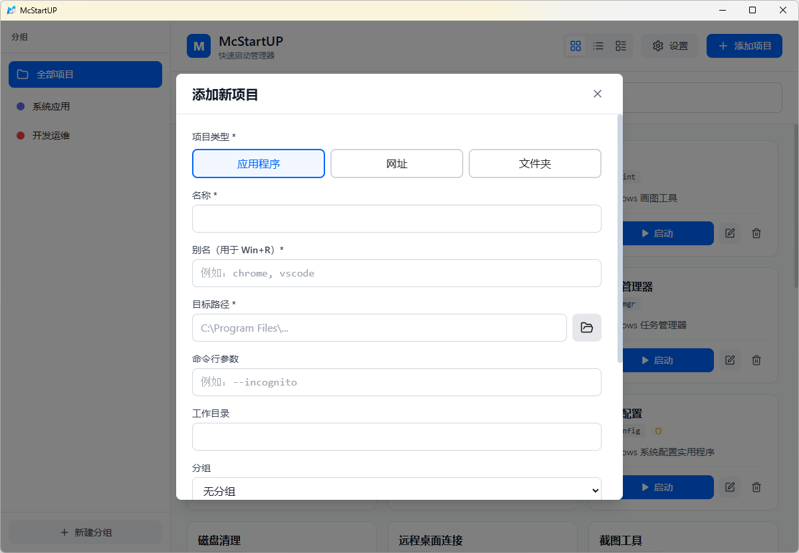
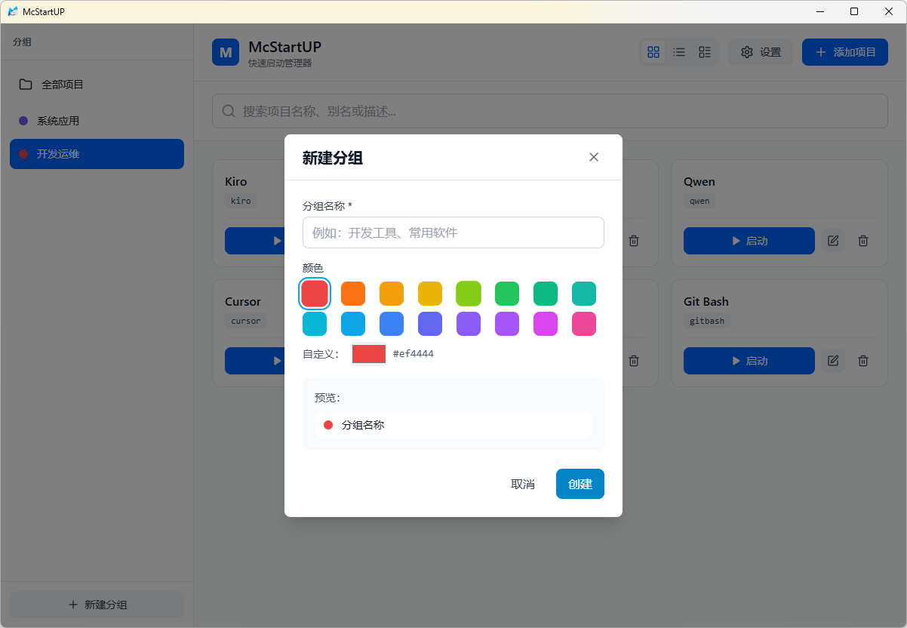

# McStartUP

<div align="center">


**简洁高效的 Windows 快速启动管理器**

[](LICENSE)
[](https://github.com/inspoaibox/mcstartup/releases)
[](https://github.com/inspoaibox/mcstartup/stargazers)

[官网](https://inspoaibox.github.io/mcstartup) · [下载](https://github.com/inspoaibox/mcstartup/releases) · [问题反馈](https://github.com/inspoaibox/mcstartup/issues)

</div>

---

## 📸 界面预览

<div align="center">

### 主界面 - 网格视图


### 添加项目 - 智能识别



### 多视图模式

<table>
  <tr>
    <td></td>
    <td></td>
  </tr>
  <tr>
    <td align="center">紧凑式布局</td>
    <td align="center">分组管理</td>
  </tr>
</table>

### 系统设置


</div>

---

## ✨ 功能特性

### 核心功能

- ⚡ **Win+R 快速启动** - 为应用设置别名，Win+R 输入即可启动
- 🎯 **拖拽添加** - 支持拖拽 .exe、.lnk、文件夹到窗口快速添加
- 📁 **多类型支持** - 应用程序、网址、文件夹、脚本统一管理
- 📜 **脚本执行** - 支持 .bat/.ps1/.ahk 脚本，可直接输入内容或选择文件
- 🎨 **分组管理** - 自定义分组和颜色，支持拖拽排序
- 👁️ **多视图模式** - 网格、列表、紧凑三种视图自由切换

### 系统集成

- 🚀 **开机自启** - 支持设置开机自动启动
- 📌 **系统托盘** - 最小化到托盘，随时唤起
- 🖱️ **右键菜单** - 右键文件快速添加到启动器
- 👑 **管理员权限** - 支持以管理员身份运行程序

### 界面设计

- 🎨 **简洁专业** - 黑白灰 + 蓝色主题，简约大气
- 🌓 **深色模式** - 支持浅色/深色主题切换
- 🔍 **快速搜索** - 实时搜索过滤启动项
- 📱 **响应式布局** - 适配不同窗口大小

### 脚本功能 ⭐

McStartUP 支持强大的脚本执行功能，让自动化任务触手可及：

#### 支持的脚本类型

- **批处理 (.bat/.cmd)** - 简单快速的系统命令
- **PowerShell (.ps1)** - 强大的自动化脚本
- **AutoHotkey (.ahk)** - 键盘鼠标自动化

#### 两种输入方式

1. **文件路径模式** - 选择已有的脚本文件
2. **直接输入模式** - 在界面中直接编写脚本内容（无需创建文件）

#### 灵活的执行选项

- ✅ 显示/隐藏执行窗口
- ✅ 以管理员权限运行
- ✅ 自定义工作目录
- ✅ 传递命令行参数

#### 应用场景

- 🗂️ 系统清理 - 一键清理临时文件、回收站
- 📊 系统信息 - 快速查看 CPU、内存、磁盘状态
- 🔄 自动备份 - 定时备份重要文件
- 🌐 网络诊断 - 检测网络连接、DNS 解析
- 🚀 开发环境 - 一键启动数据库、服务、编译项目
- ⌨️ 快捷键增强 - 使用 AutoHotkey 创建自定义快捷键

📖 **详细使用指南**: 查看 [脚本功能文档](docs/script-guide.html) 或 [SCRIPT_CONTENT_FEATURE.md](SCRIPT_CONTENT_FEATURE.md)

## 🚀 快速开始

### 下载安装

1. 前往 [Releases](https://github.com/inspoaibox/mcstartup/releases) 页面
2. 下载最新版本的 `.exe` 安装包
3. 运行安装程序，按提示完成安装
4. 首次使用需要重启 Windows 资源管理器以启用 Win+R 功能

### 首次使用

1. 点击"添加项目"按钮
2. 选择应用程序、网址或文件夹
3. 设置名称和别名（用于 Win+R）
4. 按 Win+R，输入别名即可快速启动

### 拖拽添加

直接将 .exe 文件、快捷方式或文件夹拖到窗口，自动识别并预填充信息。

## 💻 技术栈

- **前端框架**: React 18 + TypeScript
- **构建工具**: Vite
- **UI 框架**: Tailwind CSS
- **状态管理**: Zustand
- **桌面框架**: Tauri 1.5
- **后端语言**: Rust
- **数据存储**: JSON 文件

## 🛠️ 开发指南

### 环境要求

- Node.js 18+
- Rust 1.70+
- Windows 10/11

### 安装依赖

```bash
# 安装前端依赖
npm install

# 安装 Rust（如果未安装）
# 访问 https://rustup.rs/
```

### 开发模式

```bash
# 启动开发服务器
npm run tauri dev
```

### 构建生产版本

```bash
# 构建应用
npm run tauri build

# 输出位置：src-tauri/target/release/
```

## 📁 项目结构

```
mcstartup/
├── src/                    # React 前端代码
│   ├── components/         # UI 组件
│   ├── stores/            # Zustand 状态管理
│   ├── types/             # TypeScript 类型定义
│   └── utils/             # 工具函数
├── src-tauri/             # Rust 后端代码
│   ├── src/
│   │   ├── commands.rs    # Tauri 命令
│   │   ├── launcher.rs    # 启动器逻辑
│   │   ├── registry.rs    # 注册表管理
│   │   └── storage.rs     # 数据存储
│   └── tauri.conf.json    # Tauri 配置
├── docs/                  # 官网静态页面
└── README.md
```

## 🤝 贡献指南

欢迎提交 Issue 和 Pull Request！

1. Fork 本仓库
2. 创建特性分支 (`git checkout -b feature/AmazingFeature`)
3. 提交更改 (`git commit -m 'Add some AmazingFeature'`)
4. 推送到分支 (`git push origin feature/AmazingFeature`)
5. 开启 Pull Request

## 📝 更新日志

查看 [CHANGELOG.md](CHANGELOG.md) 了解版本更新历史。

## 📄 开源协议

本项目采用 [MIT](LICENSE) 协议开源。

## 🙏 致谢

- [Tauri](https://tauri.app/) - 跨平台桌面应用框架
- [React](https://react.dev/) - UI 框架
- [Tailwind CSS](https://tailwindcss.com/) - CSS 框架
- [Zustand](https://zustand-demo.pmnd.rs/) - 状态管理

## 📮 联系方式

- 问题反馈：[GitHub Issues](https://github.com/inspoaibox/mcstartup/issues)
- 功能建议：[GitHub Discussions](https://github.com/inspoaibox/mcstartup/discussions)

---

<div align="center">

**如果这个项目对你有帮助，请给个 ⭐ Star 支持一下！**

Made with ❤️ by [Your Name]

</div>
